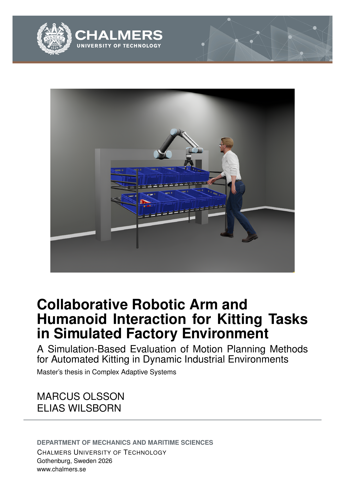

# RITA simulation

RITA (Robot In The Air) is a collaborative robot project developed as a use case for human-robot
collaboration (HRC) within the manufacturing industry, specifically for Volvo Group Trucks
Operations (GTO).

The current implementation was developed by Elias Wilsborn and Marcus Olsson under supervision of
Hamid Ebadi as part of a master thesis at Chalmers University of Technology with the title
**"Collaborative Robotic Arm and Humanoid Interaction for Kitting Tasks in Simulated Factory
Environment"**. The thesis evaluates simulation-based motion planning for a gantry-mounted UR10e
robot in an industrial kitting task, comparing OMPL, cuMotion, cuRobo, and hybrid planning
approaches in static and dynamic environments. A published version of the thesis is available here:
[rita-thesis-MO-EW.pdf](resources/rita-thesis-MO-EW.pdf).

<a href="resources/rita-thesis-MO-EW.pdf">
  
</a>

This repository has three components:

- ROS 2 container for robot control, MoveIt, and controllers.
- Isaac Sim container for simulation.
- cuMotion container planning.

[](https://www.youtube.com/watch?v=1CZqq8Toe9c)


## Prerequisites and dependencies

Follow the [instruction](https://github.com/infotiv-research/SIMLAN/blob/main/dependencies.md) to
make sure your machine has:

- Docker installed and working for your user account.
- Visual Studio Code installed.
- VS Code extension: **Dev Containers**.
- NVIDIA driver + GPU support in Docker (required for Isaac Sim GUI).

Make sure to run this command after each reboot:

```bash
xhost +local:docker
```

**optional** : to build [3D Gaussian Splatting assets](https://youtu.be/E-g0UrML0Xc), download the
[gaussian_splats package](https://infotiv-my.sharepoint.com/:f:/r/personal/hamid_ebadi_infotiv_se/Documents/SIMLAN_VIDEOS/ROBOTIC_ARM_VIDEOS/gaussian_splats?csf=1&web=1&e=QkEGdj)
and place the gaussian_splats folder in \[`assets/`\] folder. It contains 3D Gaussian Splats that
are rendered in Isaac Sim 5.1 via NVIDIA [3DGRUT](https://github.com/nv-tlabs/3dgrut). On the host
system: Run `./control.sh build_gaussian_splats` to convert all source `.ply` files under `assets/`
into USDZ files with embedded collision that Isaac Sim can reference. [Demo video](https://www.youtube.com/watch?v=ICLsGB9Ihvs)

## DevContainers

Open the project in VS Code. If VS Code does not prompt automatically, open command palette
(`Ctrl+Shift+P`) and run `Dev Containers: Reopen in Container`.

You have three configurations:

- `UR10 ROS2 DevContainer`: ROS 2 development and control stack.
- `IsaacSim DevContainer`: Isaac Sim runtime and ROS bridge side.
- `UR10e cuMotion DevContainer`: cuMotion planner runtime.

The best place to learn the available workflows, start components, and understand the command
entrypoints is open a new terminal by going to `Terminal -> New terminal` and type:

```bash
./control.sh help
```

### ROS2

> in `UR10 ROS2 DevContainer` vscode container open a new terminal and run the following commands:

To stop launch processes and remove workspace build artifacts (`build/`, `install/`, `log/`) and
rebuild the workspace. These commands only need to be executed once:

```bash
./control.sh clean
./control.sh build
```

Start robot control:

```bash
./control.sh ros
```

### IsaacSim simulation

> in `IsaacSim DevContainer` vscode container open a new terminal and run the following commands:

Inside the container terminal run **one of the following commands**. Inside the Isaac GUI press
`Yes` in the pop up warning about Python Scripting Components and then click on the `Play` button in
the GUI:

```bash
./control.sh sim # Simple

./control.sh sim_cylinder # Starts the scene with the moving cylinder obstacle enabled

./control.sh sim_humanoid # Starts the scene with the humanoid obstacle
```

Isaac Sim can also be run headless. Start it with:

```bash
./control.sh sim_headless
```

After headless Isaac Sim is running, play and stop the simulation timeline with:

```bash
./control.sh sim_headless play
./control.sh sim_headless stop
```

**optional** : If you have built the Gaussian splat assets, the generated `.usdz` files are
available in Isaac Sim through the Content Browser in 'My computer' under`/ros2_ws/assets/`. To add
one to your scene, locate the asset you want and drag it from the Content Browser into the viewport
or onto the Stage.

### UR10e motion backend

> in `UR10e cuMotion DevContainer` vscode container open a new terminal and run the following
> commands:

Inside the container terminal execute one of the motion backend:

```bash
./control.sh cumotion

./control.sh curobo

./control.sh ompl

./control.sh hybrid
```

#### cumotion

Keep in mind that cuMotion can take a few minutes to start on first run. for cumotion workflow,
start planning only after the `cuMotion is ready for planning queries` message appears. The default
planner is set to cuMotion. cuMotion builds on cuRobo and is exposed to MoveIt 2 through a MoveIt
plugin.

#### curobo

Curobo can take a few minutes to start on first run. Start planning only after the
`Unified planner ready with initial planner: classic` message appears. Curobo workflow launches
`curobo_ros`, the curobo world bridge, the trajectory forwarder used for RViz execution, and the
dedicated curobo RViz.

#### ompl

The OMPL planner is CPU only and should be set in Rviz2 under the context window.

#### hybrid (cuRobo MotionGen + MPC)

The [hybrid planner](https://youtu.be/Himwl89G8vw) combines cuRobo MotionGen as a **global planner**
(computes a full collision-free trajectory) with cuRobo MPC as a **local planner** (reactively
tracks the global trajectory at high frequency). When the MPC detects an obstacle it cannot avoid,
MoveIt Hybrid Planning automatically triggers a global replan.

The hybrid launch starts MoveIt (move_group + RViz), the cuRobo trajectory planner, the cuRobo world
bridge, and the MoveIt Hybrid Planning components in a single command.

**Using RViz:** set a goal pose with the interactive marker and click **Plan & Execute**. The bridge
intercepts the MoveGroup action, routes it through the hybrid pipeline, and streams MPC commands to
the robot.

### Running Control Scenarios

Make sure that a motion backend (preferably curobo or cumotion) is up and running before executing
the control commands and the **simulation is started**.

#### Pick and Place Scenario

[](https://www.youtube.com/watch?v=3d-NdI3MTQc)

In the cuMotion container, open a new terminal and run the following commands:

```bash
# Default: MoveIt backend with cuMotion pipeline
./control.sh pick_and_place

```

### Dynamic Environment

In the Isaac Sim container, open a new terminal to modify the environment as below

### moving human

[](https://www.youtube.com/watch?v=47wNTquTGOw)

In the Isaac Sim container, open a new terminal to control the humanoid animation:

```bash
# Play the dab animation
./control.sh humanoid play dab

# Play the pick animation
./control.sh humanoid play pick

# Stop the humanoid animation
./control.sh humanoid stop
```

## Automated testing

For the automated test workflow, see [TESTING.md](./TESTING.md).

## Code quality

Install the pre-commit hooks once on the host:

```bash
sudo apt install pre-commit
pre-commit install              # runs on git commit
```

Run all hooks manually against the full repo:

```bash
pre-commit run --all-files
```

# Credits

The project is done by as a part of Master Thesis within infotiv:

- Elias Wilsborn
- Marcus Olsson

Team/Tech Lead: Hamid Ebadi

RITA designs are Inspired by:

- [Towards an infrastructure for preparation and control of intelligent automation systems](https://research.chalmers.se/publication/528129/file/528129_Fulltext.pdf)
- [To Collaborate and Coexist with Robots in an Industrial Setting: UX-based design guidelines for cobots in Industry 4.0 and 5.0](https://www.diva-portal.org/smash/get/diva2:1882744/FULLTEXT01.pdf)
- [Perceived Safety Aspects when Collaborating with Robots in the Manufacturing Industry: Applying an HTO Methodology](https://uu.diva-portal.org/smash/get/diva2:1863125/FULLTEXT01.pdf)

This work was carried out within Artwork research projects:

- The EUREKA ITEA4 [ArtWork](https://www.vinnova.se/p/artwork---the-smart-and-connected-worker/) -
  The smart and connected worker financed by Vinnova under the grant number 2023-00970.

| INFOTIV AB                            | CHALMERS                               | Volvo Group                    |
| ------------------------------------- | -------------------------------------- | ------------------------------ |
|  |  |  |

To see a complete list of contributors see the [changelog](CHANGELOG.md).

# License

This project is licensed under the [BSD 3-Clause License](LICENSE.txt)

Portions of the code are adapted from:

- Universal Robots ROS 2 repositories (BSD-3-Clause)
- Robotiq ROS 2 repositories (BSD-3-Clause / Apache-2.0)
- ROS 2 Control Tutorial by PickNik Robotics (Apache-2.0)

The code in the repo is taken from
[ur10e_2f140_topic_based_ros2_control](https://github.com/qdeyna/ur10e_2f140_topic_based_ros2_control)
and adapted for this project

This repository vendors the cuRobo ROS packages directly in `src/`:

- `src/curobo_msgs`
- `src/curobo_ros`
- `src/curobo_rviz`

These packages originated from the following upstream repositories:

- `curobo_ros`: `https://github.com/Lab-CORO/curobo_ros.git`
- `curobo_msgs`: `https://github.com/Lab-CORO/curobo_msgs.git`
- `curobo_rviz`: `https://github.com/Lab-CORO/curobo_rviz.git`
